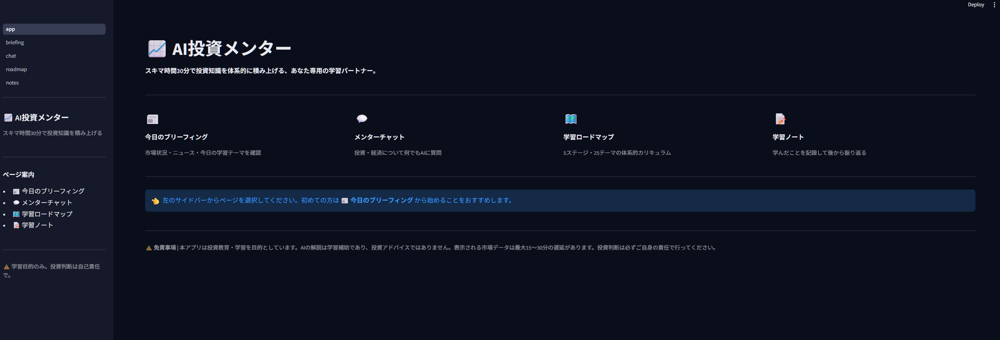
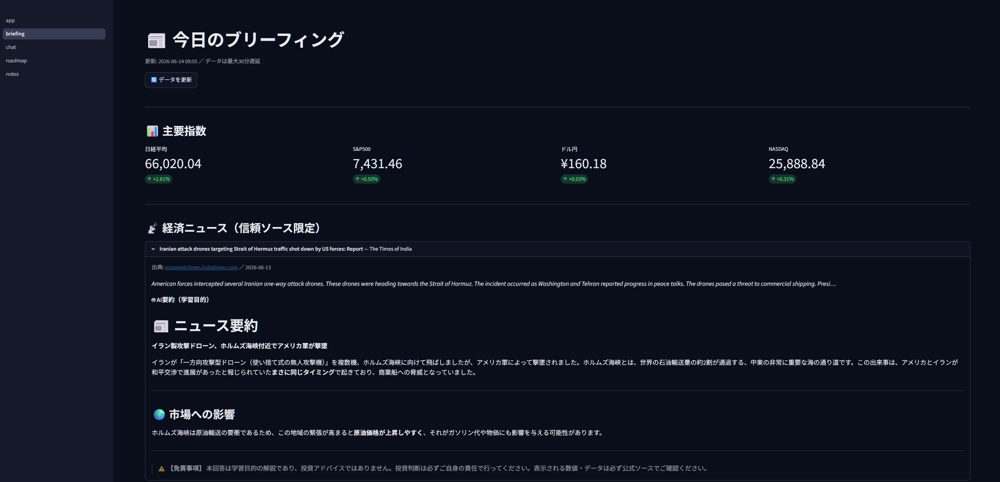
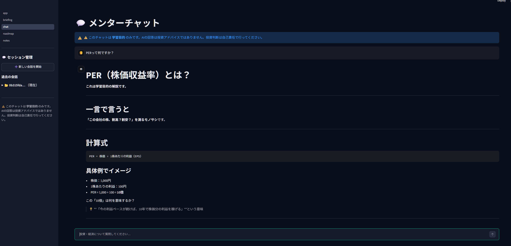

# AI投資メンター

> 投資・経済・市場を体系的に学ぶ、ローカル動作のAI家庭教師Webアプリ

「四季報を読む時間がない会社員が、スキマ時間30分で投資知識を積み上げる」ことを目的に開発したパーソナル学習ツールです。

---

## プロジェクト概要

投資初心者が体系的に学べる環境を、ローカル完結で構築しました。  
AIとのチャットで疑問をその場で解消しながら、カリキュラムに沿って段階的に知識を積み上げられます。  
市場データはリアルタイムに近い形で取得し、「今日の市場」と「今日の学習」を毎日連動させる設計です。

---

## 技術スタック

| カテゴリ | 採用技術 |
|---------|---------|
| 言語 | Python 3.11 |
| UI | Streamlit |
| AI エンジン | Claude API（claude-sonnet-4-6） |
| 株価・指数データ | yfinance |
| ニュース取得 | NewsAPI v2 |
| データ保存 | SQLite |
| 環境変数管理 | python-dotenv |
| ロギング | loguru |
| テスト | pytest |
| パッケージ管理 | uv |
| 動作環境 | Windows / WSL Ubuntu 20.04 / ローカル |

---

## 機能一覧

### 1. 今日のブリーフィング
朝5〜10分で市場の状況と学習テーマを把握するダッシュボード。

- 主要4指数の前日比表示（日経平均・S&P500・ドル円・NASDAQ）
- 信頼ソース限定の経済ニュース3本 + AI要約
- 学習進捗に連動した「今日の学習テーマ」AI提案
- 市場データ取得日時・異常値警告表示

### 2. メンターチャット
投資・経済・市場についてなんでも質問できるAI家庭教師。

- 会話履歴をSQLiteに永続化（セッションをまたいで継続）
- 複数セッションの管理・切り替え
- ユーザーの学習レベルに合わせた初心者向け解説
- チャット内容からの学習ノート自動生成
- 投資アドバイス禁止・免責明示をシステムプロンプトで制御

### 3. 学習ロードマップ
5ステージ・25テーマの体系的カリキュラムと進捗管理。

- STAGE 1〜5（投資基礎 → 市場理解 → 企業分析 → マクロ経済 → 投資戦略）
- 各テーマにミニクイズ3問（全75問）
- 進捗バーとステータス管理（未着手 / 学習中 / 完了）
- クイズ正答率の記録・フィードバック

### 4. 学習ノート
チャットで学んだことの記録と振り返り。

- チャット履歴からAIがノートを自動生成
- 手動メモの追加
- キーワード検索・ソース別フィルタリング
- タグ管理

---

## 📸 画面イメージ

### 🏠 ホーム画面 / 📊 今日のブリーフィング
| | |
|:---:|:---:|
|  |  |
| ホーム画面 | 今日のブリーフィング |

### 💬 メンターチャット / 📚 学習ロードマップ
| | |
|:---:|:---:|
|  |  |
| メンターチャット | 学習ロードマップ |

### 📝 学習ノート
| | |
|:---:|:---:|
|  | |
| 学習ノート | |

## システム構成図

```
┌─────────────────────────────────────────────────────┐
│                   Streamlit UI                       │
│                                                      │
│  ┌──────────┐  ┌──────────┐  ┌────────┐  ┌──────┐  │
│  │ブリーフィ │  │メンター  │  │ロード  │  │学習  │  │
│  │ング      │  │チャット  │  │マップ  │  │ノート│  │
│  └────┬─────┘  └────┬─────┘  └───┬────┘  └──┬───┘  │
└───────┼──────────────┼────────────┼───────────┼──────┘
        │              │            │           │
┌───────▼──────────────▼────────────▼───────────▼──────┐
│                    Core Layer                         │
│                                                      │
│  ┌─────────────┐  ┌──────────────┐  ┌─────────────┐ │
│  │market_data  │  │claude_client │  │news_client  │ │
│  │（yfinance） │  │（Claude API）│  │（NewsAPI）  │ │
│  └─────────────┘  └──────────────┘  └─────────────┘ │
│                  ┌──────────────┐                    │
│                  │   prompts    │                    │
│                  │（システムPR）│                    │
│                  └──────────────┘                    │
└──────────────────────────────────────────────────────┘
        │
┌───────▼──────────────────────────────────────────────┐
│                   DB Layer（SQLite）                  │
│                                                      │
│  chat_history  learning_progress  notes  market_cache│
└──────────────────────────────────────────────────────┘
        │
┌───────▼──────────────────────────────────────────────┐
│               Curriculum（JSON）                      │
│         stages.json: 5ステージ・25テーマ・75問        │
└──────────────────────────────────────────────────────┘
```

---

## 起動方法

### 前提条件

- Python 3.11+
- [uv](https://github.com/astral-sh/uv)（パッケージマネージャー）
- Anthropic API キー（[取得先](https://console.anthropic.com)）
- NewsAPI キー（[取得先](https://newsapi.org)）※省略可

### セットアップ

```bash
# リポジトリをクローン
git clone <repository-url>
cd investment-mentor

# 仮想環境の作成と依存パッケージのインストール
uv venv --python 3.11
uv pip install -r requirements.txt

# 環境変数の設定
cp .env.example .env
# .env を編集して API キーを設定
```

### `.env` の設定

```
ANTHROPIC_API_KEY=your_anthropic_api_key_here
NEWS_API_KEY=your_newsapi_key_here   # 省略するとニュース機能がスキップされます
```

### アプリの起動

```bash
uv run streamlit run app.py
```

ブラウザで `http://localhost:8501` が自動的に開きます。

### テストの実行

```bash
uv run pytest tests/ -v
# 144件のテストが実行されます
```

---

## 開発のこだわり

### データ品質

**「数値はAPIから、解説はAIから」を徹底しました。**

- 株価・指数データは yfinance から取得。AIに数値を生成させない。
- バリデーションを3層で実装：
  - 空データ検出（取得失敗時のフォールバック）
  - 異常価格検出（0以下の値を警告）
  - 異常変動検出（前日比±30%超で警告）
- 市場データは30分キャッシュでAPI節約（UTC/JST時刻ズレも考慮）
- ニュースは22ドメインの信頼ソースリストでフィルタリング

### セキュリティ

- APIキーは `.env` のみで管理。コードへの直書きを禁止し、CI/gitignore で除外。
- ユーザー入力はClaudeへ渡す前に2,000文字制限でサニタイズ。
- システムプロンプトで投資アドバイス・銘柄推奨を明示的に禁止。
- すべてのAPI呼び出しを try-except で囲み、技術的エラー詳細をUIに露出しない。

### テスト

- **144テスト** を pytest で実装（外部API呼び出しはすべてモックで分離）。
- SQLite テストは `tmp_path` fixture で完全分離。本番DBを汚染しない。
- SQLite の `PARSE_DECLTYPES` による UTC/JST タイムゾーンズレ問題を特定・解消。
- カバー範囲：市場データバリデーション・ニュースフィルタリング・DB CRUD・Claudeクライアントエラーハンドリング。

### UI設計

- Streamlit ダークモード + カスタムテーマ（グリーンアクセント）で金融ダッシュボードらしい外観。
- `@st.cache_data(ttl=1800)` で市場データ・ニュースを30分キャッシュし、API費用を抑制。
- 全ページのフッターに免責事項を常時表示。

---

## プロジェクト構成

```
investment-mentor/
├── app.py                     # Streamlit メインエントリーポイント
├── pages/
│   ├── 1_briefing.py          # 今日のブリーフィング
│   ├── 2_chat.py              # メンターチャット
│   ├── 3_roadmap.py           # 学習ロードマップ
│   └── 4_notes.py             # 学習ノート
├── core/
│   ├── claude_client.py       # Claude API ラッパー
│   ├── market_data.py         # yfinance ラッパー + バリデーション
│   ├── news_client.py         # NewsAPI ラッパー + フィルタリング
│   └── prompts.py             # システムプロンプト定義
├── db/
│   ├── database.py            # SQLite 初期化・マイグレーション
│   ├── chat_repository.py     # 会話履歴 CRUD
│   ├── progress_repository.py # 学習進捗 CRUD
│   └── notes_repository.py    # 学習ノート CRUD
├── curriculum/
│   └── stages.json            # 5ステージ・25テーマ・75問クイズ
├── tests/                     # pytest テストコード（144件）
├── .env.example               # 環境変数テンプレート
├── requirements.txt
└── README.md
```

---

## 免責事項

> **このアプリは投資教育・学習を目的としています。**
>
> - AIの解説は学習補助であり、投資アドバイスではありません。
> - 表示される市場データは最大15〜30分の遅延があります。
> - データの正確性を保証するものではありません。
> - 投資判断は必ずご自身の責任で行ってください。
> - 本アプリの利用によって生じた損失について、開発者は一切の責任を負いません。
